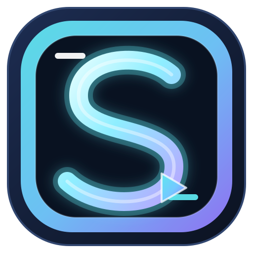

# Shorts Studio

<p align="center">
  
</p>

<p align="center"><strong>A local-first workspace for turning long videos into polished short-form clips.</strong></p>

<p align="center">
  <a href="https://github.com/wiifhub/AI-Youtube-Shorts-Generator/releases/tag/v1.0.0">Latest release: v1.0.0</a>
  &nbsp; | &nbsp;
  <a href="CHANGELOG.md">Changelog</a>
  &nbsp; | &nbsp;
  <a href="docs/USER_GUIDE.md">Beta user guide</a>
  &nbsp; | &nbsp;
  <a href="CONTRIBUTING.md">Contributing</a>
  &nbsp; | &nbsp;
  <a href="https://github.com/wiifhub/AI-Youtube-Shorts-Generator/releases">Downloads</a>
  &nbsp; | &nbsp;
  <a href="https://github.com/wiifhub/AI-Youtube-Shorts-Generator/issues">Support</a>
</p>

Shorts Studio is an independent desktop and web workspace maintained by **wiifhub**. It takes a YouTube URL or a local video, finds strong moments, gives you control over the framing and captions, and renders ready-to-publish clips. Local mode keeps source media and rendered files on your computer; API mode is available when you prefer hosted processing.

## v1.0.0 production release

The production-readiness work was developed on [`beta/v1.0.0`](https://github.com/wiifhub/AI-Youtube-Shorts-Generator/tree/beta/v1.0.0) and is now merged into `main`.
Read the [beta user guide](docs/USER_GUIDE.md) for the versioned API,
project migrations, optional media backups, Shorts Factory review packages,
Google/YouTube sign-in, approval-first YouTube publishing, direct
TikTok/Instagram publishing, analytics feedback, and A/B variants. The
interactive OpenAPI/Swagger surface is available at `/docs` when the server is
running; new integrations should use `/api/v1/`. The older `/api/` routes
remain available during the deprecation window and advertise their v1
successor in response headers. Beta artifact and release-gate evidence is
tracked in [docs/release-gates-v1.0.0-beta.md](docs/release-gates-v1.0.0-beta.md).
The separate beta prerelease remains available at the [`beta` release channel](https://github.com/wiifhub/AI-Youtube-Shorts-Generator/releases/tag/beta),
and the production `v1.0.0` release contains the same gated runtime with the
versioned package metadata below.

## Windows installation

The latest packaged Windows desktop binaries are v1.0.0, released alongside the Docker distribution below.

### Recommended: installer

1. Download [ShortsStudio-Setup-v1.0.0.exe](https://github.com/wiifhub/AI-Youtube-Shorts-Generator/releases/download/v1.0.0/ShortsStudio-Setup-v1.0.0.exe).
2. Run the installer and choose whether to create a desktop shortcut.
3. Start **Shorts Studio** from the Start menu or desktop.

The installer includes the native desktop shell, Python runtime, FFmpeg/FFprobe, CUDA runtime files used by supported builds, the original Shorts Studio icon, and the complete UI. Projects are written to `%LOCALAPPDATA%\ShortsStudio\output` so an install under `Program Files` remains writable.

Windows may show SmartScreen for an unsigned build. Select **More info -> Run anyway** only when the file came from the release link above. A commercial signing certificate is not bundled with this open release.

### Portable ZIP

1. Download [ShortsStudio-v1.0.0-windows.zip](https://github.com/wiifhub/AI-Youtube-Shorts-Generator/releases/download/v1.0.0/ShortsStudio-v1.0.0-windows.zip).
2. Extract the entire ZIP to a folder (do not run the EXE inside the archive).
3. Run `unblock_and_start.bat`, or double-click `ShortsStudio.exe` after Windows has unblocked the files.

The ZIP is self-contained and can be moved to another Windows 10/11 64-bit machine. Keep the folder together; the EXE, `_internal`, FFmpeg, and CUDA DLLs are a single package.

### Updating from inside the app

Open **Settings** in the sidebar (or use the top-bar **Settings** button) and click **Check for updates**. If a newer packaged release is available, the button changes to **Install vX.Y.Z**. Confirm once; Shorts Studio downloads the Windows package, preserves your projects and `.env`, replaces the package, and restarts. If you are running from source, the same control opens the GitHub release page so you can update the source checkout safely.

Settings also includes:

- **Appearance:** Dark, Light, or system theme, five accent palettes, plus a reduced-motion preference.
- **API credentials:** Enter a MuAPI key for API mode, or select OpenAI, Gemini, or local Ollama for highlight ranking. Hosted keys are masked, session-only, and excluded from saved jobs.
- **Rendering defaults:** Local/API mode, output resolution, caption preset, aspect ratio, face framing, and a default save folder for new projects.
- **Storage & privacy:** The active output path, free space, an **Open output folder** shortcut, and a local-first processing explanation.
- **Backups, cleanup & brand presets:** Download or restore metadata backups, inspect storage usage, clean old generated caches, and save reusable caption/branding/music settings.
- **Runtime diagnostics:** FFmpeg, FFprobe, Whisper, CUDA, disk space, and concurrency status with a refresh action.
- **Provider controls:** Select the local OpenAI/Gemini/Ollama provider, model, and temperature per project, enter current OpenAI/Gemini/MuAPI rates, and receive a transparent estimate only when the provider supplies usage; prices are never hard-coded.

## Docker deployment

Release `v1.0.0` bundles the Windows desktop app and the reproducible Docker server image in one release. Docker supports Linux hosts, Docker Desktop, NAS machines, and home servers; the container serves the same FastAPI workspace over HTTP and does not need the Windows desktop shell or a separate Python installation on the host.

### Quick start (CPU)

From a checkout of this repository:

```bash
cp .env.docker.example .env.docker
# Edit .env.docker if you want MuAPI, OpenAI, or Gemini ranking.
docker compose --env-file .env.docker up --build
```

Then open <http://127.0.0.1:7860>. Projects, uploads, transcripts, Whisper models, and rendered clips live in the named `shorts_studio_data` volume and survive container restarts. `docker compose down` keeps that data; `docker compose down -v` removes it.

The published CPU image is also available at `ghcr.io/wiifhub/shorts-studio:v1.0.0` (the `latest` tag tracks the newest release) and is built for `linux/amd64` and `linux/arm64`:

```bash
docker run --rm -p 127.0.0.1:7860:7860 \
  -v shorts_studio_data:/data \
  --env-file .env.docker \
  ghcr.io/wiifhub/shorts-studio:v1.0.0
```

### NVIDIA GPU mode

Install the NVIDIA Container Toolkit first, then run the opt-in Compose profile:

```bash
docker compose --env-file .env.docker --profile gpu up --build shorts-studio-gpu
```

The GPU workspace is available at <http://127.0.0.1:7861> and uses `LOCAL_WHISPER_DEVICE=cuda` by default. Set `LOCAL_WHISPER_MODEL` in `.env.docker` to choose a different model. CPU mode remains the fallback when no GPU is available.

The Compose file binds to loopback for safety and now **requires** `SHORTS_API_TOKEN` in `.env.docker` — the application refuses to start when bound to a non-loopback address without a token (override only with the explicit `SHORTS_ALLOW_UNAUTHENTICATED_REMOTE=true` escape hatch). The token enables the built-in bearer/session-cookie authentication; still use TLS or a reverse proxy for transport protection. API keys are passed at runtime and are never copied into the image.

The Docker image intentionally omits `pywebview` and `pystray`: the browser is the container's desktop surface. The regular Windows package still provides the browser-free native window.

CPU and GPU Compose profiles intentionally use the same `shorts_studio_data`
volume. You can stop one profile and start the other without losing projects,
uploads, transcripts, or downloaded Whisper models. The CPU and container
dependency sets use different OpenCV wheels (`opencv-python` locally and
`opencv-python-headless` in Docker); install only the set that matches the
runtime rather than combining both wheels in one environment.

The arm64 CPU image intentionally omits `faster-whisper`: its current
`onnxruntime` dependency has no compatible manylinux arm64 wheel. API mode,
downloads, exports, and the web workspace remain supported on arm64. See
[`docs/deployment/arm64-support.md`](docs/deployment/arm64-support.md) for the
audited lock and exact platform-resolution command.

For Kubernetes, use the CPU-only chart documented in
[`docs/deployment/kubernetes.md`](docs/deployment/kubernetes.md). It targets
Kubernetes 1.28+, one replica with a ReadWriteOnce `/data` volume, a ClusterIP
Service, and an optional TLS Ingress. Multi-replica or multi-node deployments
must put a shared gateway rate limiter in front of the service.

## Screenshots

These screenshots are captured from the Shorts Studio application itself.

| Dashboard | Editing workspace |
| --- | --- |
|  |  |

The theme switch applies to the entire interface. The light Settings view is shown here as well:


## What you can do

- **Find highlights** with Whisper transcription, language auto-detection, sentence-aware boundaries, optional YouTube chapter hints, virality scoring, hook text, and an explanation for every selected moment.
- **Edit the frame** with a face-framing toggle, manual drag positioning, crop-to-fill, fit plus blurred background, and foreground zoom.
- **Design captions** with Bold, Clean, Boxed, and Karaoke presets, custom font, size, color, safe position, word timing, SRT/VTT downloads, and optional filler-word cleanup.
- **Clean and shape audio** with silence trimming, real silent-section jump cuts, loudness normalization, background-noise reduction, optional music, and speech-aware music ducking.
- **Fine-tune the timeline** with multi-range cuts whose transcript and word timestamps are remapped to the concatenated result, fade/slide/zoom transitions, explicit multi-highlight merge, and an editable transcript before export.
- **Mix music precisely** with per-project volume, fade-in, and fade-out controls.
- **Choose layouts** with a single frame or a two-panel speaker layout, plus watermark, intro, outro, and automatic thumbnails.
- **Start quickly with project presets** for Podcast / interview, Educational, Reaction / gaming, Story / emotional, Kids / family, or fully custom settings. Presets are starting points and remain editable.
- **Review before committing** with a low-resolution preview that uses the same crop, captions, layout, and timestamps as the final render.
- **Manage projects** with SQLite-backed durable jobs, checkpoints, batch sources, cancellation that terminates active FFmpeg children, retry, resume-after-restart, rename, duplicate, archive, recoverable delete, and Undo last delete.
- **Export creator assets** as a ZIP containing clips, thumbnails, caption files, `metadata.json`, publishing text, and a factory review manifest.
- **Reuse and recover work** with named brand presets, storage usage reporting, conservative cache cleanup, versioned migrations, and metadata or optional media-inclusive backup/restore. Source media and completed clips are preserved by default.
- **Publish safely** to YouTube Shorts, TikTok, and Instagram Reels through approval-first official APIs. Google sign-in uses PKCE and process-memory tokens; YouTube supports resumable video transfer, category/privacy/scheduling controls, custom thumbnails, and SRT/VTT captions. Unattended publishing is disabled unless explicitly enabled in deployment settings, and public unattended uploads require a second opt-in.
- **Run the Shorts Factory** by submitting one upload or URL to `/api/v1/factory/jobs`. Completed work exposes clips, hooks, captions, thumbnails, metadata, and platform export plans at `/api/v1/jobs/{id}/factory`; every direct upload still requires a recorded human approval checkpoint.
- **Run experiments** with per-clip A/B metadata variants, append-only platform analytics observations, and explainable retention/engagement feedback.
- **Render efficiently** with bounded parallel FFmpeg workers, live Whisper progress in the existing SSE stream, and short-lived caching for read-only catalogs.
- **Use platform export contracts** for YouTube Shorts, TikTok, Instagram Reels, Instagram 4:5, and YouTube 16:9 presets that validate canvas and duration before rendering.
- **Use GPU controls** to choose Whisper model and Auto/CPU/CUDA device. CUDA is detected at runtime and safely falls back to CPU.
- **Use dark or light mode** from the top-bar switch. Your choice is saved locally and applies to panels, forms, previews, captions, timelines, dialogs, status states, and the closed screen.
- **Personalize the accent** from Settings with Ocean, Indigo, Sunset, Emerald, or Berry palettes. Accent choices update controls, focus states, timelines, captions, badges, and the preview without changing your Dark, Light, or System appearance choice.
- **Update in place** from the Settings view. Packaged Windows builds can download the newest release from this repository and restart without a reinstall.
- **Run without a browser** in the packaged desktop build through an embedded WebView2 window. A browser fallback remains available when WebView2 is unavailable.
- **Use hosted providers safely** by entering MuAPI, OpenAI, or Gemini credentials in Settings. Session-entered keys are sent only with the relevant job and are never saved in project files.
- **Inspect activity without a terminal** in the Logs view. Filter all projects or one project by level and text, refresh while a render is running, and download the visible entries or a single project's full log. Log output is bounded and credential-redacted.
- **Protect remote API access** with optional `SHORTS_API_TOKEN` authentication, per-client sliding-window limits, tighter upload/job limits, bounded JSON/upload sizes, redacted errors/logs, safe output roots, and signed release-digest checks.

## Source setup

Source mode is useful for development or for running on a non-Windows host. Python 3.10 or newer is required.

```powershell
git clone https://github.com/wiifhub/AI-Youtube-Shorts-Generator.git
cd AI-Youtube-Shorts-Generator
.\install_windows.bat
.\start_studio.bat
```

`install_windows.bat` creates `venv`, installs the local dependencies, and copies `.env.example` to `.env` when needed. The launcher opens an embedded WebView2 window when possible. To force the browser fallback:

```powershell
.\venv\Scripts\python.exe launcher.py --browser
```

You can also run the server directly:

```powershell
.\venv\Scripts\python.exe -m web.app
# open http://127.0.0.1:7860
```

Use the **Quit** button in the app to stop the local server. `Ctrl+C` in the terminal also stops a source launch.

## Local and API modes

The workspace defaults to Local mode. Local mode uses `yt-dlp`, `faster-whisper`, OpenCV, and FFmpeg on your machine. Highlight ranking can use OpenAI or Gemini, or the built-in heuristic fallback when no key is configured. Enter an optional local ranking key in **Settings -> API credentials**, or configure it in `.env`. Local rendering does not impose a per-clip service limit, but it does use your CPU/GPU, storage, and any provider API you select.

API mode delegates download, transcription, ranking, and auto-crop to the configured MuAPI service. Enter `MUAPI_API_KEY` in **Settings -> API credentials** for the current session, or add it to `.env` for a persistent local setup. Session keys are held in memory, sent only to MuAPI for the job, and are not written to project files. Provider terms, network availability, and API costs are separate from Shorts Studio.

API mode accepts hosted `http(s)` sources and the provider's basic crop path. Local-only controls (custom captions, audio processing, cuts, branding, custom output folders, and local LLM/Whisper settings) are disabled in the UI and rejected by the API with a clear validation error instead of being silently ignored.

### Optional CUDA setup

For local Whisper acceleration on a supported NVIDIA GPU:

```powershell
.\install_gpu_windows.bat
```

The script checks for `nvidia-smi`, installs a CUDA-enabled PyTorch wheel, and leaves CPU available as a fallback. In the app, select **Whisper device -> CUDA GPU**. The Settings view reports the detected device and current fallback reason.

## Configuration

Copy `.env.example` to `.env` and edit only the settings you need. Never commit `.env` or paste keys into an issue.

| Setting | Purpose | Default |
| --- | --- | --- |
| `MUAPI_API_KEY` | Persistent API mode authentication (Settings can supply a session-only key instead) | empty |
| `LLM_PROVIDER` | Local ranking provider: `openai`, `gemini`, or `ollama` | `openai` |
| `OPENAI_API_KEY` / `GEMINI_API_KEY` | Optional persistent local ranking keys (Settings can supply session-only keys instead) | empty |
| `LOCAL_WHISPER_MODEL` | `tiny`, `base`, `small`, `medium`, or `large-v3` | `base` |
| `LOCAL_WHISPER_DEVICE` | `auto`, `cpu`, `cuda`, `mps`, `directml`, or `rocm` | `auto` |
| `SHORTS_FACE_DETECTOR` | Face tracking mode: `auto`, `dnn`, `haar`, or `off` | `auto` |
| `SHORTS_FACE_DNN_MODEL` / `SHORTS_FACE_DNN_CONFIG` | Optional OpenCV SSD model/config paths used by the DNN detector | empty (Haar fallback) |
| `LOCAL_OUTPUT_DIR` | Source-mode project/output root | `output` |
| `SHORTS_STUDIO_DATA_DIR` | Container/user data root for projects, caches, and update state | unset (Docker: `/data`) |
| `LOCAL_BURN_CAPTIONS` | Burn captions into local MP4 files | `true` |
| `LOCAL_HEURISTIC_FALLBACK` | Rank locally without a provider key | `true` |
| `SHORTS_RENDER_WORKERS` | Maximum parallel local FFmpeg clip workers (`LOCAL_MAX_FFMPEG_PROCS` remains a compatibility alias) | `2` |
| `SHORTS_RESPONSE_CACHE_SECONDS` | TTL for read-only API catalog responses; `0` disables caching | `10` |
| `SHORTS_STUDIO_BROWSER` | Force browser fallback instead of WebView2 | `false` |
| `SHORTS_PORT` | Preferred loopback port | `7860` |
| `SHORTS_AUTO_RESUME` | Recover interrupted projects on start | `true` |
| `SHORTS_MIN_FREE_GB` | Free-space guard before a render | `0.5` |
| `SHORTS_ALLOW_EXTERNAL_PATHS` | Explicitly allow local media/save paths outside the output root | `false` |
| `SHORTS_MAX_UPLOAD_MB` | Maximum uploaded source size | `2048` |
| `SHORTS_MAX_JSON_MB` | Maximum JSON request body accepted by the API | `2` |
| `SHORTS_API_TOKEN` | Token required for every API route except health/auth status/login; **mandatory for non-loopback binds** | empty (disabled) |
| `SHORTS_BIND_HOST` | Bind host the fail-closed startup guard inspects | `127.0.0.1` |
| `SHORTS_COOKIE_SECURE` | Force the `Secure` attribute on session cookies (`auto` by default: the request is https, or a proxy sent `X-Forwarded-Proto: https`) | empty |
| `SHORTS_MAX_QUEUED_JOBS` | Combined running+queued render budget before new jobs are rejected with 429 | `64` |
| `SHORTS_RATE_LIMIT_PER_MINUTE` | General per-client API request limit | `600` |
| `SHORTS_UPLOAD_RATE_LIMIT_PER_MINUTE` | Per-client upload limit | `10` |
| `SHORTS_JOB_RATE_LIMIT_PER_MINUTE` | Per-client job submission limit | `30` |
| `SHORTS_RATE_LIMIT_BACKEND` | `memory` for one process or `sqlite` for same-host multi-process workers | `memory` |
| `SHORTS_RATE_LIMIT_STORE` | Shared SQLite rate-limit database path when the backend is `sqlite` | `<data>/rate_limits.sqlite3` |
| `SHORTS_TRUST_PROXY_HEADERS` | Use `X-Forwarded-For` for rate-limit identity only behind a trusted proxy | `false` |
| `YOUTUBE_CLIENT_ID` / `YOUTUBE_CLIENT_SECRET` | Optional OAuth client for approval-first YouTube uploads; keep secrets in the deployment manager | empty |
| `YOUTUBE_OAUTH_REDIRECT_URI` | OAuth callback registered in Google Cloud | `http://127.0.0.1:7860/api/youtube/oauth/callback` |
| `YOUTUBE_OAUTH_SCOPES` | Space-separated Google scopes; captions require `youtube.force-ssl` | `youtube.upload youtube.force-ssl` |
| `SHORTS_YOUTUBE_AUTO_PUBLISH` | Explicit deployment opt-in for unattended YouTube uploads after approval | `false` |
| `SHORTS_YOUTUBE_ALLOW_PUBLIC_AUTOPUBLISH` | Separate opt-in required for unattended public YouTube uploads | `false` |
| `TIKTOK_CLIENT_KEY` / `TIKTOK_CLIENT_SECRET` | Optional TikTok Content Posting API OAuth client | empty |
| `TIKTOK_ACCESS_TOKEN` | Optional pre-authorized TikTok token for a managed deployment; never commit it | empty |
| `INSTAGRAM_APP_ID` / `INSTAGRAM_APP_SECRET` / `INSTAGRAM_USER_ID` | Optional Meta Graph credentials for Instagram Reels | empty |
| `INSTAGRAM_ACCESS_TOKEN` | Optional pre-authorized Instagram token for a managed deployment; never commit it | empty |
| `INSTAGRAM_GRAPH_VERSION` | Meta Graph API version used for Reels | `v25.0` |
| `SHORTS_REQUIRE_SIGNED_UPDATES` | Require GitHub release digests for in-app updates | `true` |
| `SHORTS_MAX_UPDATE_MB` | Maximum in-app update asset size | `4096` |

Packaged builds keep the optional `.env` beside the executable but place writable project data under `%LOCALAPPDATA%\ShortsStudio`. A custom **Save folder** in the workspace creates named folders such as `20260910_214500_shorts_source_a1b2c3d4`.

For multiple Uvicorn workers on one host, set `SHORTS_RATE_LIMIT_BACKEND=sqlite`
and point every worker at the same database path on a filesystem that supports
SQLite WAL. Multi-host deployments should use a gateway limiter (Redis,
Envoy, or the managed ingress) because a local SQLite file cannot coordinate
independent hosts.

### Optional modern face detector

`SHORTS_FACE_DETECTOR=auto` keeps the app self-contained: it uses the OpenCV
SSD DNN detector when both model files are present, then falls back to the
bundled Haar detector. Set `SHORTS_FACE_DETECTOR=off` to disable face tracking,
`haar` to force the fallback, or `dnn` to require the modern detector. The DNN
model is optional and is not downloaded automatically; point
`SHORTS_FACE_DNN_MODEL` and `SHORTS_FACE_DNN_CONFIG` at the two OpenCV SSD files
when you have them. Missing files in explicit `dnn` mode produce a clear
configuration error instead of a silent misframe.

## Command line and Python API

The CLI remains available for automation:

```powershell
.\venv\Scripts\python.exe main.py "https://www.youtube.com/watch?v=VIDEO_ID" --mode local --num-clips 3 --aspect-ratio 9:16
.\venv\Scripts\python.exe main.py "C:\Videos\talk.mp4" --mode local --output-json output\result.json
```

The source URL may be a YouTube URL, a `file://` URL, or a local path. The library entry point is `shorts_generator.generate_shorts(...)`; the result contains transcript data, ranked highlights, and rendered clip paths/URLs.

## Local web API

The loopback FastAPI service powers the desktop shell and can be used by local tooling:

| Route | Purpose |
| --- | --- |
| `GET /api/health` | Liveness check |
| `GET /api/system` | FFmpeg, storage, CUDA, model, and setup status |
| `GET /api/jobs` | List saved projects |
| `POST /api/jobs` / `POST /api/jobs/batch` | Start one or many projects; optional `X-MuAPI-Key`, `X-OpenAI-Key`, `X-Gemini-Key`, and `X-LLM-Provider` headers supply session credentials |
| `GET /api/jobs/{id}` | Read progress and results |
| `GET /api/logs` | Browse bounded, credential-redacted activity logs with project, level, stage, text, and limit filters |
| `GET /api/logs/download` | Download the currently filtered activity log as plain text |
| `GET /api/jobs/{id}/logs` | Download one project's full activity log (legacy route) |
| `POST /api/jobs/{id}/cancel` | Cancel a running project |
| `POST /api/jobs/{id}/preview` | Render a lightweight draft |
| `GET /api/jobs/{id}/timeline` / `GET /api/jobs/{id}/waveform` | Read transcript markers and cached audio peaks for the editor timeline |
| `GET /api/jobs/{id}/events` | Stream durable progress snapshots over Server-Sent Events |
| `GET /api/provider-costs` / `PUT /api/provider-costs` | Read or save creator-supplied USD/token rates |
| `POST /api/jobs/{id}/clips/{index}` | Regenerate one clip with editor settings |
| `POST /api/jobs/{id}/merge` | Merge separate local highlights with an optional transition |
| `PATCH /api/jobs/{id}/transcript` | Save edited transcript segments and timing |
| `GET /api/export-presets` | List platform canvas, frame-rate, and duration contracts |
| `GET /api/jobs/{id}/export` | Download a project ZIP |
| `GET /api/storage` / `POST /api/storage/cleanup` | Inspect usage and remove only confirmed, expired generated caches |
| `GET /api/backup` / `POST /api/restore` | Download or merge a versioned metadata backup; `include_media=true` carries bounded generated media |
| `GET/POST/DELETE /api/brand-presets` | Manage reusable local brand presets |
| `GET /api/publishing/platforms` | List supported platform handoff adapters |
| `GET /api/jobs/{id}/publishing` | Generate metadata and official manual-upload links for supported platforms |
| `POST /api/factory/jobs` | Queue a URL or local upload for a reviewable Shorts Factory package |
| `GET /api/jobs/{id}/factory` / `POST /api/jobs/{id}/factory/approve` | Inspect the generated factory package and record per-clip human decisions |
| `GET /api/youtube/oauth/status` / `GET /api/youtube/oauth/start` / `GET /api/youtube/oauth/callback` / `POST /api/youtube/oauth/disconnect` | Start, complete, inspect, or clear the optional PKCE Google/YouTube connection |
| `GET /api/tiktok/oauth/status` / `GET /api/tiktok/oauth/start` / `GET /api/tiktok/oauth/callback` | Connect the TikTok Content Posting API |
| `GET /api/instagram/oauth/status` / `GET /api/instagram/oauth/start` / `GET /api/instagram/oauth/callback` | Connect the Instagram Graph API for Reels |
| `POST /api/jobs/{id}/publish` | Return an approval plan or execute a confirmed direct upload for a selected clip/variant |
| `POST /api/jobs/{id}/youtube/publish` | Return an approval plan or execute a confirmed private/resumable YouTube upload |
| `GET/POST/PATCH /api/jobs/{id}/variants` | Create and update A/B metadata variants for a clip |
| `GET/POST /api/jobs/{id}/analytics` / `POST /api/jobs/{id}/variants/{variant_id}/analytics` | Record platform observations and receive feedback |
| `GET /api/analytics/summary` | Aggregate feedback across the project library |
| `GET /api/errors` / `GET /api/migrations` | Read the v1 error catalog and current project migration status |
| `GET /api/auth/status` / `POST /api/auth/login` / `POST /api/auth/logout` | Inspect and manage the optional API-token session |
| `GET /api/update` | Check the latest wiifhub release |
| `POST /api/update/apply` | Download and apply a packaged update |
| `POST /api/shutdown` | Stop the local server |

All routes bind to `127.0.0.1` by default. When `SHORTS_API_TOKEN` is set, every API route other than health/auth status/login requires the token as `Authorization: Bearer ...` or `X-Shorts-Token`. Login exchanges the token for an HttpOnly session cookie whose value is unrelated to the token (rotating the token revokes issued sessions), and cookie-authenticated mutations must pass same-origin plus `X-CSRF-Token` double-submit checks (the bundled UI does this automatically). Startup fails closed when binding a non-loopback `SHORTS_BIND_HOST` without a token. Keep TLS and an upstream reverse proxy for internet-facing use; choose the SQLite limiter for same-host multi-worker deployments and a gateway limiter for multi-host deployments.

Every path above also exists under `/api/v1/`. Versioned errors use the
stable `{error, code}` contract documented by `/api/v1/errors`. Legacy calls
receive `Deprecation: true`, `Sunset: 2027-09-15`, and a successor `Link`
header.

## Project layout

```text
shorts_generator/      Pipeline, ranking, transcription, and renderers
web/                   FastAPI coordinator, typed models, security, SQLite queue, and route modules
  app.py               Worker lifecycle, persistence, shared render state, and error policy
  job_routes.py        Project library, queue control, retry, and log endpoints
  editor_routes.py     Clip editing, timeline, waveform, export, and media endpoints
  feature_routes.py    Storage, backup, transcript, presets, factory, and publishing endpoints
  factory.py           Reviewable Shorts Factory manifests and approval state
  experiment_routes.py A/B variants and analytics feedback endpoints
  migrations.py        Pure project-format migrations shared by startup, restore, and CLI
  analytics.py         Local analytics ledger aggregation and recommendations
  system_routes.py     Auth, uploads, diagnostics, setup, and update endpoints
assets/                Original icon and project artwork
tests/                 Network-free API, pipeline, ranking, transcript, clipping, and security tests
installer/             Inno Setup definition
deploy/helm/           CPU-only Kubernetes 1.28+ Helm chart
docs/deployment/       arm64 dependency proof and Kubernetes target
docs/adr/              Accepted v1 design decisions
docs/USER_GUIDE.md     Beta workflow guide with screenshots
CONTRIBUTING.md        Development, testing, and review policy
launcher.py            Browser-free desktop launcher
main.py                CLI entry point
scripts/build.py       Cross-platform portable/installer build entry point
scripts/sign_artifacts.py  Optional Authenticode/codesign/notarization
install_windows.bat    Source dependency setup
build_portable.bat     PyInstaller portable build
build_installer.bat    Inno Setup installer build
Dockerfile             CPU server image
Dockerfile.gpu         NVIDIA CUDA server image
docker-compose.yml     CPU/GPU Compose profiles
requirements-docker.txt Container server dependencies
requirements-docker-arm64.txt  Audited arm64 CPU dependency lock
requirements-dev.txt  Pinned test, lint, type-check, and audit tools
tests/e2e/             Opt-in Playwright creator-flow and accessibility checks
pyproject.toml        Project metadata and Ruff/mypy/pytest configuration
output/                Local projects (ignored by Git)
```

## Building a release

### Developer checks

Install the pinned development tools before making changes, then run the same
checks used by GitHub Actions:

```powershell
.\venv\Scripts\python.exe -m pip install -r requirements-dev.txt
.\venv\Scripts\python.exe -m ruff check shorts_generator web launcher.py main.py tests scripts
.\venv\Scripts\python.exe -m mypy --strict
.\venv\Scripts\python.exe -m bandit -r shorts_generator web launcher.py main.py scripts -ll -x tests
.\venv\Scripts\python.exe -m pytest --cov=shorts_generator --cov=web --cov-fail-under=55
.\venv\Scripts\python.exe -m pip_audit -r requirements-dev.txt --progress-spinner off
.\venv\Scripts\python.exe -m pip_audit -r requirements-local.txt --progress-spinner off
.\venv\Scripts\python.exe -m pip_audit -r requirements-gpu.txt --progress-spinner off
.\venv\Scripts\python.exe -m pip_audit -r requirements-docker.txt --progress-spinner off
.\venv\Scripts\python.exe -m pip_audit -r requirements-docker-arm64.txt --progress-spinner off
Get-ChildItem web\static -Filter *.js -File; Get-ChildItem web\static\modules -Filter *.js -File | ForEach-Object { node --check $_.FullName }

# Optional browser flow (install Chromium once):
python -m playwright install chromium
$env:RUN_BROWSER_E2E="1"; .\venv\Scripts\python.exe -m pytest -q tests/e2e
```

The CI workflow also validates the Docker Compose file, the arm64 dependency
lock, and the Helm chart. `pre-commit install` enables the Ruff and mypy hooks
locally. Mypy runs strict mode across `shorts_generator`, `web`, `launcher.py`,
and `main.py`; optional SDKs are isolated behind dynamic runtime adapters.

For an existing data directory, the migration tool is safe to inspect first:

```powershell
.\venv\Scripts\python.exe scripts\migrate_data.py --data-dir C:\path\to\shorts-data
.\venv\Scripts\python.exe scripts\migrate_data.py --data-dir C:\path\to\shorts-data --apply
```

The apply mode writes a timestamped `.migration-backups` copy before updating
JSON mirrors and SQLite records.  The CPU Dockerfile uses a dependency stage,
BuildKit pip caching, and a non-root runtime stage; generated media and model
caches stay on `/data` rather than in the image layer.

Build from a clean Windows checkout with the local dependencies installed:

```powershell
.\venv\Scripts\python.exe -m pip install -r requirements-local.txt
.\venv\Scripts\python.exe scripts\build.py portable
.\venv\Scripts\python.exe scripts\build.py installer
```

The `.bat` files remain compatibility wrappers for existing Windows shortcuts.
To sign release artifacts, configure the owner-controlled certificate/Apple
credentials in the environment and run:

```powershell
.\venv\Scripts\python.exe scripts\sign_artifacts.py release\ShortsStudio-Setup-v1.0.0.exe --report release\signing-report-v1.0.0.json
```

Without those credentials the tool records an explicit unsigned report and
never claims a signature. The release workflow can require signing by passing
`--required`.

The generated `dist`, `build`, and `release` directories are intentionally ignored by Git. Before publishing, verify the EXE starts, `/api/health` returns 200, the theme switch works in both modes, the Quit action stops the listener, and the ZIP/installer hashes match the uploaded files.

The Docker image is built and published automatically by `.github/workflows/docker.yml` on pushes to `main` and version tags. A local Docker build is available on any Docker host:

```bash
docker build -t shorts-studio:local .
docker run --rm -p 127.0.0.1:7860:7860 -v shorts_studio_data:/data shorts-studio:local
```

The GPU image is built locally through the Compose `gpu` profile because it requires the host's NVIDIA runtime. The published CPU image is built for `linux/amd64` and `linux/arm64`; arm64 intentionally uses `requirements-docker-arm64.txt` and runs API/web/export features without local faster-whisper until its onnxruntime wheel is available.

## Troubleshooting

- **The window opens in a browser:** install the Microsoft WebView2 Runtime, or set `SHORTS_STUDIO_BROWSER=false` and restart. Browser fallback is expected when WebView2 cannot load.
- **SmartScreen warns about the EXE:** use the release links above and choose `More info -> Run anyway`; the current public binaries are not commercially signed.
- **CUDA DLL or driver errors:** use Settings -> diagnostics, install/update the NVIDIA driver, rerun `install_gpu_windows.bat`, or select CPU. CPU mode remains supported.
- **No provider key:** Enter a session key under Settings -> API credentials, configure the matching `.env` variable, or let Local mode use the built-in heuristic fallback when `LOCAL_HEURISTIC_FALLBACK=true`. API mode requires a MuAPI key.
- **YouTube download errors:** try a local upload or update yt-dlp with `venv\Scripts\python.exe -m pip install --upgrade yt-dlp`.
- **Port 7860 is busy:** launch with `launcher.py --port 7861`; the desktop launcher also chooses a free loopback port automatically.
- **A render stops:** open the project again. Persisted logs, interrupted-job recovery, Retry, and recoverable output folders are designed to preserve completed work.

## Identity and contribution

This repository is the standalone **Shorts Studio** project maintained and released by **wiifhub**. Branding, UI, desktop packaging, release assets, and the creator workflow are owned and versioned here. Please open an issue with the exact release version, operating system, and a redacted log when reporting a problem.

## Related Projects

- [awesome-vibecoded-saas](https://github.com/Anil-matcha/awesome-vibecoded-saas) — broader catalog of open-source SaaS alternatives featuring this Shorts workflow.
- [Muapi open-source alternatives](https://muapi.ai/open-source/alternative) — compare the Shorts workflow with the paid creator tools it targets.

## License

MIT License

Copyright (c) 2026 Bruno Mazzonna

Permission is hereby granted, free of charge, to any person obtaining a copy
of this software and associated documentation files (the "Software"), to deal
in the Software without restriction, including without limitation the rights
to use, copy, modify, merge, publish, distribute, sublicense, and/or sell
copies of the Software, and to permit persons to whom the Software is
furnished to do so, subject to the following conditions:

The above copyright notice and this permission notice shall be included in all
copies or substantial portions of the Software.

THE SOFTWARE IS PROVIDED "AS IS", WITHOUT WARRANTY OF ANY KIND, EXPRESS OR
IMPLIED, INCLUDING BUT NOT LIMITED TO THE WARRANTIES OF MERCHANTABILITY,
FITNESS FOR A PARTICULAR PURPOSE AND NONINFRINGEMENT. IN NO EVENT SHALL THE
AUTHORS OR COPYRIGHT HOLDERS BE LIABLE FOR ANY CLAIM, DAMAGES OR OTHER
LIABILITY, WHETHER IN AN ACTION OF CONTRACT, TORT OR OTHERWISE, ARISING FROM,
OUT OF OR IN CONNECTION WITH THE SOFTWARE OR THE USE OR OTHER DEALINGS IN THE
SOFTWARE.
